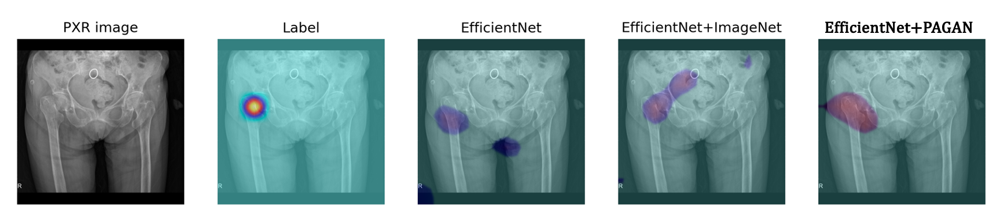

# PAGAN_PXR
PAGAN stands for patch image auxiliary GAN.

The generator of PAGAN is a special generator which takes both patch images and full size images as inputs. 
This generator would produce two outputs which are a binary label and a synthetic image. 

  

